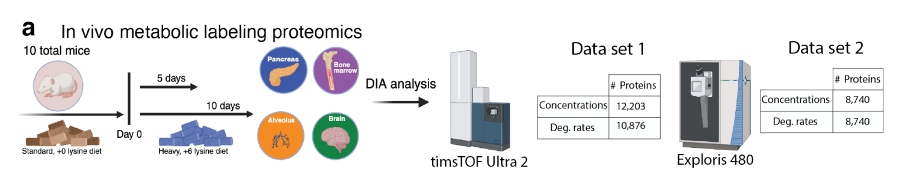

# Impact of protein degradation and cell growth on mammalian proteomes
Analysis from Leduc, *et al.*, *bioRxiv*, 2025, doi: [10.1101/2025.02.10.637566](https://doi.org/10.1101/2025.02.10.637566)

## Abstract
Cellular protein concentrations are controlled by rates of synthesis and clearance, the latter including protein degradation and dilution due to growth. Thus, cell growth rate may influence the mechanisms controlling variation in protein concentrations. To quantify this influence, we analyzed the growth-dependent effects of protein degradation within a cell type (between activated and resting human B-cells), across human cell types and mouse tissues. This analysis benefited from deep and accurate quantification of over 12,000 proteins across four primary tissues using plexDIA. The results indicate that growth-dependent dilution can account for 40% of protein concentration changes across conditions. Furthermore, we find that the variation in protein degradation rates is sufficient to account for up to 50% of the variation in concentrations within slowly growing cells as contrasted with 7% in growing cells. Remarkably, degradation rates differ significantly between proteoforms encoded by the same gene and arising from alternative splicing or alternate RNA decoding. These proteoform-specific degradation rates substantially determine the proteoform abundance, especially in the brain. Thus, our model and data unify previous observations with our new results and demonstrate substantially larger than previously appreciated contributions of protein degradation to protein variation at slow growth, both across proteoforms and tissue types.

## Data
Protein clearance and synthesis rates were measured from murine tissue samples using *in vivo* metabolic pulse with lysine labeled with stable heavy isotopes. Samples were then analyzed by (i) timsTOF Ultra 2, which quantified over 12,000 total protein concentrations and over 10,000 degradation rates across all tissues and (ii) Exploris 480, which quantified 8,740 concentrations and degradation rates:

- Raw LC-MS and searched data can be found on MassIVE, [MSV000097050](https://massive.ucsd.edu/ProteoSAFe/dataset.jsp?task=732135590e454112b315f6e610891080).
- Searched and processed data can be found on [Zenodo](https://zenodo.org/records/14827610).

----- 
  

## Analysis 
In this work, we demonstrate that protein degradation plays a significant role in determining protein concentrations across the proteome in slowly growing cells. Reduction in the influence of degradation in growing cells and variation in rates of degradation across samples contribute to changes in protein concentration across different conditions. 

To reproduce these finding, the following two R scripts can be run:
- Tissue_metabolic_labeling.R for plotting figures based on tissue data aqcuired by Leduc *et al.*, 2025
- External_data_and_simulation.R for plotting figures based on previously published data

Both scripts call functions from the Functions_for_analysis.R script. 
The starting point should be making sure all the packages that are loaded in the begining of the functions script are installed.

These scripts read in data files that are store on [Zenodo](https://zenodo.org/records/14827610) so there should be no need to download any additional data.

